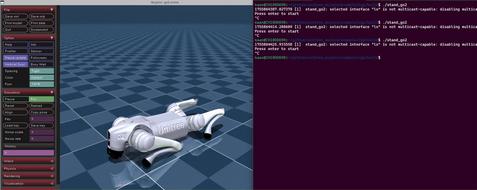

# g1-robot

## G1 arms move

The example here uses the `g1_dual_arm_example` from the SDK together with the MuJoCo [simulation](doc/simulation.md).

## Go2 stand up

The example here uses the `stand_go` from the MuJoCo Cpp example directory (`unitree_mujoco/example/cpp`).

