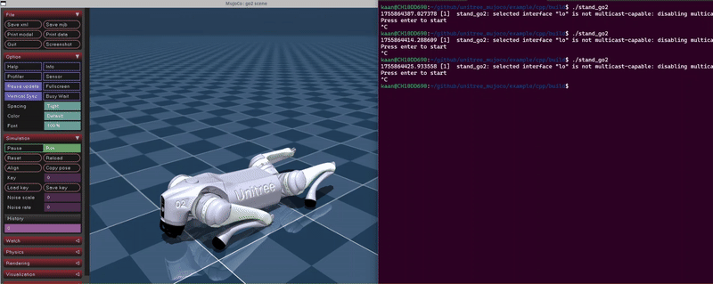

## MuJoCo simulation

- [unitree_mujoco](https://github.com/unitreerobotics/unitree_mujoco)

The file `unitree_mujoco\simulate\config.yaml` defines which robot to be loaded. The following examples use the direct DDS communication.

### Go2

The default simulation loads the `go2`. A stand up simulation can be run by (assumed, that the `unitree_mujoco` has already been launched):

```sh
cd $HOME/github/unitree_mujoco/example/cpp
cmake -S . -B build
cd build
./stand_go
```



### G1

The example used here is built with the SDK (CMakefile option) and deployed in the `build/bin` directory.
In the file `unitree_sdk2/example/g1/low_level/g1_dual_arm_example.cpp`, line 176 has to be changed to `ChannelFactory::Instance()->Init(1, networkInterface);`. The the SDK has to be recompiled (see setup).

In the `unitree_mujoco/simulate/config.yaml`, set the `config.yaml` to the following:

```yaml
robot: "g1"         
robot_scene: "scene_29dof.xml" 
...
```

Run the simulation

```sh
cd unitree_mujoco/simulate/build
./unitree_mujoco

# in another terminal (using the localhost interface lo)
cd unitree_sdk2/build/bin
LD_LIBRARY_PATH=/opt/unitree_robotics/lib/:$LD_LIBRARY_PATH ./g1_dual_arm_example lo
```


